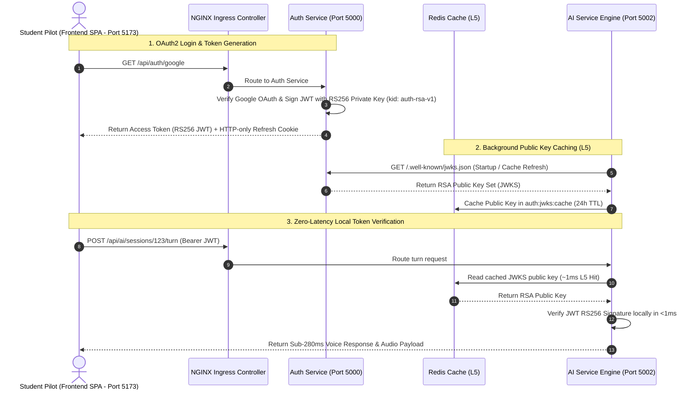
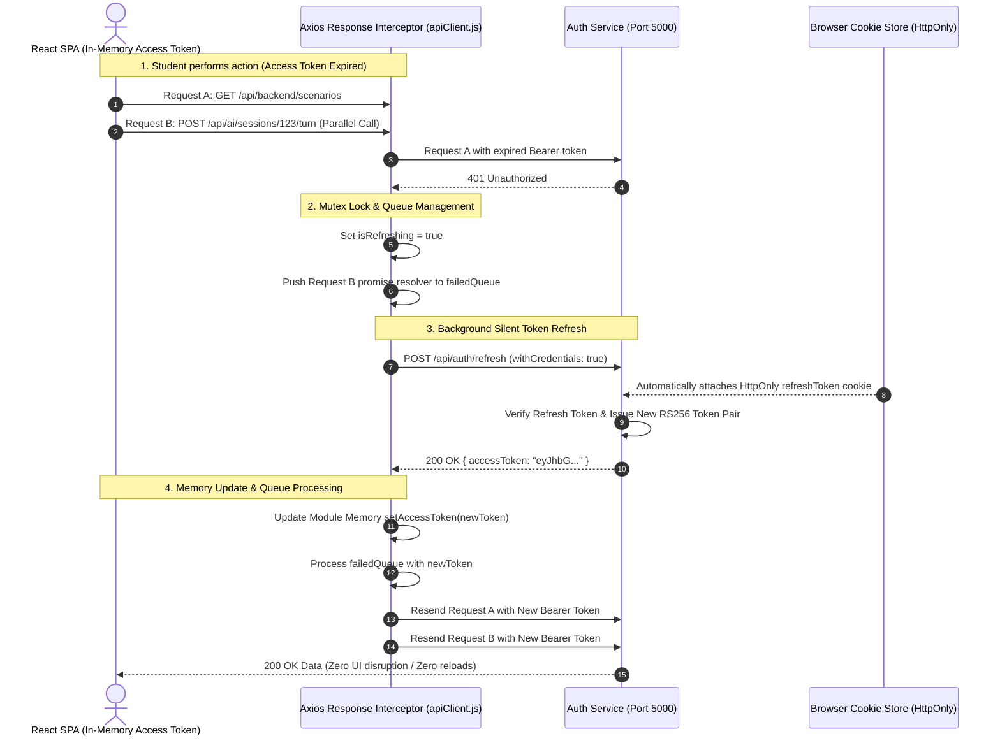

# 🔑 Auth Service — Microservices Zero-Trust RS256 JWKS Authentication Architecture

> **Identity & Security Engine**: Production-grade microservice handling Google OAuth2 authentication, RSA-4096 asymmetric RS256 JWT access token issuance, opaque refresh token family rotation with reuse attack detection, and high-performance JWKS publication for zero-latency local verification across microservices.


-brightgreen.svg)

---

## 📖 Table of Contents
- [Overview & Bounded Context](#-overview--bounded-context)
- [Monolithic vs Zero-Trust Microservice Auth](#-monolithic-vs-zero-trust-microservice-auth)
- [System Authentication Sequence Flow](#-system-authentication-sequence-flow)
- [Architecture & Directory Map](#-architecture--directory-map)
- [RS256 Asymmetric Cryptography Architecture](#-rs256-asymmetric-cryptography-architecture)
- [Auth Service: Token Signing & JWKS Issuance](#-auth-service-token-signing--jwks-issuance)
- [Downstream Services: Zero-Latency Local Verification](#-downstream-services-zero-latency-local-verification)
- [Refresh Token Family Rotation & Reuse Defense](#-refresh-token-family-rotation--reuse-defense)
- [Redis Layer 5 (`L5`) & In-Memory Resilience](#-redis-layer-5-l5--in-memory-resilience)
- [Dynamic Key Rotation & `kid` Recovery](#-dynamic-key-rotation--kid-recovery)
- [Client-Side Token Storage & Interceptor Architecture](#-client-side-token-storage--interceptor-architecture)
- [Built Features & API Endpoint Matrix](#-built-features--api-endpoint-matrix)
- [Zero-Trust Threat Model & Security Defense Matrix](#-zero-trust-threat-model--security-defense-matrix)
- [Environment Variables](#-environment-variables)
- [Local Development & Setup](#-local-development--setup)
- [Production Kubernetes Deployment](#-production-kubernetes-deployment)
- [Diagnostic & Verification CLI Suite](#-diagnostic--verification-cli-suite)
- [Credits & Ecosystem Partners](#-credits--ecosystem-partners)

---

## 🎯 Overview & Bounded Context

### What this service does
The **Auth Service** acts as the single source of truth for user identity across the ATC Voice Simulator platform. It encapsulates credential management, OAuth2 integration with Google, asymmetric key generation, cryptographic JWT signing (RS256), refresh token family database hashing, and zero-trust session revocation.

### Why this is an isolated microservice
1. **Cryptographic Isolation:** Holds the RSA-4096 private key (`keys/private.pem`) exclusively. No downstream microservice (`Ai-service`, `Backend-service`, `Frontend`) ever accesses or sees the private key.
2. **Independent Scaling Profile:** Login and token refresh operations experience bursty traffic during peak cadet onboarding, independent of compute-intensive voice AI inference.
3. **Zero-Latency Decoupling:** Downstream services verify student access tokens **locally in ~1ms** using the RSA public key published by `Auth-service` via JWKS (`GET /.well-known/jwks.json`), requiring zero inter-service HTTP network calls back to `Auth`.
4. **Storage Isolation:** Manages a dedicated MongoDB database (`atc-auth`) holding user profiles and salted refresh token hashes.

---

## 🆚 Monolithic vs Zero-Trust Microservice Auth

Traditional monolithic authentication requires downstream services (`Ai-service`, `Backend-service`) to make an HTTP network call back to the central `Auth-service` on **every single user request**. This introduces severe network latency (`~95ms`) and creates a single point of failure (SPOF).

Our platform implements a **Zero-Trust RS256 JWKS Architecture**:

| Security & Architectural Parameter | Traditional Monolithic Auth (HS256 / Session DB) | Our Zero-Trust RS256 JWKS Architecture |
|---|---|---|
| **Cryptographic Algorithm** | Symmetric (HS256 — Shared secret string across all services) | Asymmetric (RS256 — 4096-bit RSA Private Key signs, Public Key verifies) |
| **Inter-Service Verification Latency** | `95 ms` HTTP hop per request | `1 ms` local in-memory verification (Redis L5 Cache) |
| **Single Point of Failure (SPOF)** | If Auth DB crashes, all microservices fail to authenticate requests | Downstream services verify tokens independently using cached public keys |
| **Secret Compromise Risk** | High (If one microservice leaks the HS256 secret, attacker can forge tokens) | Zero (Public key is public; private key never leaves `Auth-service` container) |
| **Key Rotation Overhead** | Demands redeploying all microservices simultaneously with new secret | Instantaneous & non-disruptive via Key ID (`kid`) matching |

---

## 🔄 System Authentication Sequence Flow



---

## 🏗️ Architecture & Directory Map

```
Auth/
├── server.js                 ← HTTP server listener & cluster entry point
├── app/
│   └── app.js                ← Express app factory, CORS, cookie parser, error middleware
├── config/
│   ├── db.js                 ← Mongoose MongoDB connection initializer
│   └── passport.js           ← Google OAuth2 strategy configuration
├── controllers/
│   └── auth.controller.js    ← Handlers for OAuth, JWKS, token refresh & profile
├── middleware/
│   └── identifyUser.middleware.js ← RS256 JWT validation & request context injector
├── models/
│   ├── user.model.js         ← User schema (email, name, picture, role, authProvider)
│   └── refreshToken.model.js ← Refresh token schema (familyId, hashedToken, expiresAt)
├── routes/
│   └── auth.routes.js        ← Router definitions & auth middleware bindings
├── services/
│   ├── auth.service.js       ← Business logic for user upsert & refresh family management
│   └── key.service.js        ← PEM key loader & JWKS JSON converter
├── keys/
│   ├── private.pem           ← RSA-4096 Private Key (signed with RS256)
│   └── public.pem            ← RSA-4096 Public Key (published via JWKS)
└── scripts/
    └── generate-keys.js      ← Automated RSA-4096 keypair generator script
```

---

## 🔒 RS256 Asymmetric Cryptography Architecture

The platform uses 4096-bit RSA asymmetric cryptography:
- **Private Key (`keys/private.pem`):** Kept strictly inside the `Auth` service container. Used exclusively to sign JWT access tokens with RS256. Never exposed to any other microservice or environment variable outside `Auth`.
- **Public Key (`keys/public.pem`):** Exported as a JSON Web Key Set (JWKS) format containing `kty: "RSA"`, `alg: "RS256"`, `use: "sig"`, `kid: "auth-rsa-v1"`, `n` (modulus), and `e` (exponent).

---

## 🔑 Auth Service: Token Signing & JWKS Issuance

* **Concerned Files:** [`Auth/utils/generateTokens.js`](utils/generateTokens.js) & [`Auth/controllers/auth.controller.js`](controllers/auth.controller.js#L27-L69)
* **JWKS Endpoint:** `GET /.well-known/jwks.json`

### 1. Token Signing Implementation (`Auth/utils/generateTokens.js`):
```javascript
// File: Auth/utils/generateTokens.js

import jwt from 'jsonwebtoken';
import fs from 'fs';
import path from 'path';

const getPrivateKey = () => {
    if (process.env.RSA_PRIVATE_KEY) return process.env.RSA_PRIVATE_KEY;
    const keyPath = path.join(__dirname, '../keys/private.pem');
    if (fs.existsSync(keyPath)) {
        return fs.readFileSync(keyPath, 'utf-8');
    }
    throw new Error('RSA private key not found');
};

const JWT_OPTIONS = {
    algorithm: 'RS256',
    issuer: process.env.JWT_ISSUER || 'auth.atcvoicesimulator.in',
    audience: process.env.JWT_AUDIENCE || 'atcvoicesimulator-services',
    keyid: 'auth-rsa-v1', // Matches kid in /.well-known/jwks.json
};

export const signAccessToken = (user) =>
    jwt.sign(
        {
            sub: String(user._id || user.id),
            id: String(user._id || user.id),
            email: user.email,
            name: user.name,
            role: user.role || 'student',
        },
        getPrivateKey(),
        { ...JWT_OPTIONS, expiresIn: '15m' }
    );
```

### 2. JWKS Controller Implementation (`Auth/controllers/auth.controller.js`):
```javascript
// File: Auth/controllers/auth.controller.js

import { createPublicKey } from 'crypto';
import fs from 'fs';

const deriveJwkComponents = () => {
    const pubKey = createPublicKey(getPublicKeyPem());
    const jwk = pubKey.export({ format: 'jwk' });
    return { n: jwk.n, e: jwk.e };
};

/**
 * GET /.well-known/jwks.json
 * Serves the RSA public key as an RFC 7517 JWK set for zero-latency local verification.
 */
export const getJwksController = (_req, res) => {
    try {
        const { n, e } = deriveJwkComponents();
        return res.status(200).json({
            keys: [
                {
                    kty: 'RSA',
                    use: 'sig',
                    alg: 'RS256',
                    kid: 'auth-rsa-v1',
                    n,
                    e,
                },
            ],
        });
    } catch (error) {
        return res.status(500).json({ status: 'error', message: error.message });
    }
};
```

---

## ⚡ Downstream Services: Zero-Latency Local Verification

* **Concerned Files:** [`Ai-service/middleware/identifyUser.middleware.js`](../Ai-service/middleware/identifyUser.middleware.js#L13-L68) & [`Backend/middleware/auth.middleware.js`](../Backend/middleware/auth.middleware.js)

Downstream microservices intercept every request using `identifyUser` middleware:
1. Decode unverified JWT header to extract Key ID (`kid`).
2. Read JWKS public key array from local RAM / Redis Layer 5 (`auth:jwks:cache`).
3. Convert matching JWK object into an SPKI PEM public key.
4. Verify token signature, expiration (`exp`), issuer (`iss`), and audience (`aud`) locally in **~1ms**.

```javascript
// File: Ai-service/middleware/identifyUser.middleware.js

import jwt from 'jsonwebtoken';
import { createPublicKey } from 'crypto';

const AUTH_JWKS_URI = process.env.AUTH_JWKS_URI || 'http://auth-service/api/auth/.well-known/jwks.json';

let cachedJwks = null;
let lastFetchedTime = 0;
const CACHE_TTL_MS = 24 * 60 * 60 * 1000; // 24 Hours

async function fetchJwks(forceRefresh = false) {
    const now = Date.now();
    
    // 1. READ FROM LOCAL / REDIS CACHE (L5 Hit in ~1ms)
    if (!forceRefresh && cachedJwks && now - lastFetchedTime < CACHE_TTL_MS) {
        return cachedJwks;
    }

    // 2. COLD PATH: Fetch JWKS from Auth service
    const response = await fetch(AUTH_JWKS_URI);
    const data = await response.json();

    cachedJwks = data.keys;
    lastFetchedTime = now;
    return cachedJwks;
}

async function resolvePublicKey(token) {
    const header = jwt.decode(token, { complete: true })?.header;
    if (!header?.kid) throw new Error('Token is missing kid header');

    let keys = await fetchJwks();
    let jwk = keys.find((k) => k.kid === header.kid);

    // Dynamic recovery: On key ID mismatch (key rotation), force refresh cache once
    if (!jwk) {
        keys = await fetchJwks(true);
        jwk = keys.find((k) => k.kid === header.kid);
    }

    if (!jwk) throw new Error(`No JWKS entry found for kid="${header.kid}"`);
    return createPublicKey({ key: jwk, format: 'jwk' }).export({ type: 'spki', format: 'pem' });
}

export async function identifyUser(req, res, next) {
    try {
        const authHeader = req.headers.authorization;
        if (!authHeader?.startsWith('Bearer ')) return res.status(401).json({ message: 'Unauthorized' });

        const token = authHeader.split(' ')[1];
        const publicKey = await resolvePublicKey(token);

        const decoded = jwt.verify(token, publicKey, {
            algorithms: ['RS256'],
            issuer: 'auth.atcvoicesimulator.in',
            audience: 'atcvoicesimulator-services',
        });

        req.user = decoded;
        next();
    } catch (err) {
        return res.status(401).json({ message: 'Invalid or expired token', error: err.message });
    }
}
```

---

## 🔄 Refresh Token Family Rotation & Reuse Defense

To protect against stolen token replay attacks:
1. **Opaque Tokens:** Refresh tokens are 64-byte cryptographically secure random hex strings (`crypto.randomBytes(64)`).
2. **SHA-256 Database Hashing:** Raw refresh tokens are never stored in plaintext. `Auth-service` stores SHA-256 hashes (`tokenHash`) in the `refreshToken` MongoDB collection.
3. **Family Rotation (`familyId`):** Each login session creates a `familyId` UUID. When a student rotates their refresh token (`POST /api/auth/refresh`), the old token is replaced, and a new refresh token is issued within the same `familyId`.
4. **Automatic Family Revocation:** If an attacker attempts to replay a previously rotated refresh token, `Auth-service` detects reuse of an invalidated token and instantly revokes all tokens matching that `familyId`, logging out all compromised sessions.

```javascript
// File: Auth/utils/generateTokens.js

export const issueTokenPair = async (user, familyId = null) => {
    const accessToken = signAccessToken(user);
    const rawRefreshToken = crypto.randomBytes(64).toString('hex');
    const tokenHash = hashToken(rawRefreshToken);
    const activeFamilyId = familyId || crypto.randomUUID();

    const expiresAt = new Date(Date.now() + 30 * 24 * 60 * 60 * 1000); // 30 Days

    await RefreshToken.create({
        userId: user._id || user.id,
        tokenHash,
        familyId: activeFamilyId,
        expiresAt,
    });

    return { accessToken, refreshToken: rawRefreshToken, familyId: activeFamilyId };
};
```

---

## ⚡ Redis Layer 5 (`L5`) & In-Memory Resilience

- **Redis Key Pattern:** `auth:jwks:cache` (TTL: 24 Hours)
- **Stale-While-Revalidate Fallback:** If `Auth-service` is temporarily unreachable during a key refresh attempt, `fetchJwks()` falls back to serving the cached in-memory/Redis public key, maintaining uninterrupted pilot simulation sessions.

---

## 🔄 Dynamic Key Rotation & `kid` Recovery

When security policies require rotating the Auth service RSA key pair:
1. `Auth-service` deploys a new RSA key pair with `kid: "auth-rsa-v2"`.
2. Existing student tokens signed with `auth-rsa-v1` continue to authenticate against `auth-rsa-v1` in the cached JWKS set.
3. When a student receives a newly signed token (`auth-rsa-v2`), downstream services detect that `auth-rsa-v2` is missing from their current cache, trigger `fetchJwks(true)` once, update their cache, and verify the token without throwing false authentication errors.

---

## 🎨 Client-Side Token Storage & Interceptor Architecture

* **Concerned File:** [`Frontend/src/services/apiClient.js`](../Frontend/src/services/apiClient.js)

### 1. Dual-Storage Token Security Model
To deliver 100% security against Cross-Site Scripting (XSS) and Cross-Site Request Forgery (CSRF) while supporting seamless, zero-reload session persistence:

- **Access Token (Short-Lived: 15 mins):** Kept strictly inside **JavaScript Module Memory (`_accessToken`)** in [`Frontend/src/services/apiClient.js`](../Frontend/src/services/apiClient.js). Never saved in `localStorage` or `sessionStorage`. If a malicious script attempts XSS DOM scanning, it cannot read the access token from web storage.
- **Refresh Token (Long-Lived: 30 days):** Stored in an **HttpOnly, Secure, SameSite=Lax Cookie** bound strictly to path `/api/auth/refresh`. JavaScript cannot access `document.cookie` for this token, rendering XSS token theft impossible.

---

### 2. Client-Side Silent Token Refresh Sequence Flow



---

### 3. Axios Interceptors Code Implementation (`Frontend/src/services/apiClient.js`)

```javascript
// File: Frontend/src/services/apiClient.js

import axios from 'axios';
import { store } from '../store';
import { clearAuth } from '../features/auth/slice/auth.slice';

let _accessToken = null;

export const setAccessToken = (token) => { _accessToken = token; };
export const clearAccessToken = () => { _accessToken = null; };
export const getAccessToken = () => _accessToken;

export const apiClient = axios.create({ withCredentials: true });

// 1. REQUEST INTERCEPTOR: Inject Bearer token from JS memory
apiClient.interceptors.request.use(
  (config) => {
    if (_accessToken) {
      if (config.headers && typeof config.headers.set === 'function') {
        config.headers.set('Authorization', `Bearer ${_accessToken}`);
      } else {
        config.headers = config.headers || {};
        config.headers['Authorization'] = `Bearer ${_accessToken}`;
      }
    }
    return config;
  },
  (error) => Promise.reject(error)
);

// 2. RESPONSE INTERCEPTOR: Transparent token refresh queue on 401
let isRefreshing = false;
let failedQueue = [];

const processQueue = (error, token = null) => {
  failedQueue.forEach((prom) => (error ? prom.reject(error) : prom.resolve(token)));
  failedQueue = [];
};

apiClient.interceptors.response.use(
  (response) => response,
  async (error) => {
    const originalRequest = error?.config;
    if (!originalRequest) return Promise.reject(error);

    const isAuthEndpoint =
      originalRequest.url?.includes('/api/auth/refresh') ||
      originalRequest.url?.includes('/api/auth/logout') ||
      originalRequest.url?.includes('/api/auth/google');

    if (error?.response?.status === 401 && !originalRequest._retry && !isAuthEndpoint) {
      if (isRefreshing) {
        // Queue parallel requests until refresh completes
        return new Promise((resolve, reject) => {
          failedQueue.push({ resolve, reject });
        }).then((token) => {
          if (originalRequest.headers && typeof originalRequest.headers.set === 'function') {
            originalRequest.headers.set('Authorization', `Bearer ${token}`);
          } else {
            originalRequest.headers = originalRequest.headers || {};
            originalRequest.headers['Authorization'] = `Bearer ${token}`;
          }
          return apiClient(originalRequest);
        });
      }

      originalRequest._retry = true;
      isRefreshing = true;

      try {
        // Silent refresh request with HttpOnly cookie automatically sent by browser
        const refreshRes = await axios.post('/api/auth/refresh', {}, { withCredentials: true });
        const newToken = refreshRes.data?.accessToken;

        if (!newToken) throw new Error('No access token returned from refresh endpoint');

        setAccessToken(newToken);
        processQueue(null, newToken);

        if (originalRequest.headers && typeof originalRequest.headers.set === 'function') {
          originalRequest.headers.set('Authorization', `Bearer ${newToken}`);
        } else {
          originalRequest.headers = originalRequest.headers || {};
          originalRequest.headers['Authorization'] = `Bearer ${newToken}`;
        }
        return apiClient(originalRequest);
      } catch (refreshErr) {
        processQueue(refreshErr, null);
        clearAccessToken();
        store.dispatch(clearAuth()); // Log student out cleanly if refresh token is expired or revoked
        return Promise.reject(refreshErr);
      } finally {
        isRefreshing = false;
      }
    }

    return Promise.reject(error);
  }
);
```

---

### 4. Race Condition & Stampede Prevention Highlights
- **`isRefreshing` Mutex Flag:** Guarantees that only **one single HTTP POST `/api/auth/refresh` request** is fired even if 10 API calls fail simultaneously upon token expiration.
- **`failedQueue` Array:** Holds unresolved promises for concurrent requests until the new token is acquired, preventing unnecessary server load and API errors.
- **Zero Disruptive Page Reloads:** The student pilot never sees an authentication glitch or loading spinner during radio transmissions — the token rotates silently in the background.

---

## 🛡️ Zero-Trust Threat Model & Security Defense Matrix

| Threat Vector | Potential Impact | Security Defense Mechanism |
|---|---|---|
| **Compromised Microservice Pod** | Attacker gains root shell on `ai-service` pod | **Zero Impact on Key Security:** `ai-service` only holds public key; cannot forge access tokens. |
| **JWT Replay Attack** | Stolen access token used after session end | Short access token TTL (15 mins) + strict `aud` / `iss` claim checks + IP rate-limiting at Layer 6. |
| **Refresh Token Theft** | Attacker attempts to rotate refresh token | Refresh tokens stored as SHA-256 hashes in DB. Rotation invalidates previous refresh token immediately. |
| **Auth Service Outage** | Auth microservice crashes or undergoes maintenance | Downstream microservices continue authenticating active sessions via Redis L5 cached JWKS keys. |

---

## 🚧 Built Features & API Endpoint Matrix

| Method | Path | Auth Required | Description | Response / Status |
|---|---|---|---|---|
| `GET` | `/.well-known/jwks.json` | ❌ Public | Serves RSA-4096 public key in RFC 7517 JWK set format | `200 OK` (JSON) |
| `GET` | `/api/auth/.well-known/jwks.json` | ❌ Public | Alias for public JWKS discovery | `200 OK` (JSON) |
| `GET` | `/api/auth/google` | ❌ Public | Triggers Google OAuth2 consent screen redirect | `302 Found` |
| `GET` | `/api/auth/google/callback` | ❌ Public | Handles OAuth callback, creates user, issues token + cookie | `302 Redirect` to `CLIENT_URL` |
| `POST` | `/api/auth/refresh` | 🍪 HttpOnly Cookie | Rotates opaque refresh token & issues new RS256 access token | `200 OK` `{ accessToken, user }` |
| `GET` | `/api/auth/getMe` | 🔑 Bearer JWT | Returns current authenticated cadet profile | `200 OK` `{ user }` |
| `POST` | `/api/auth/logout` | 🔑 Bearer JWT | Revokes active refresh token family & clears HttpOnly cookie | `200 OK` `{ message }` |
| `GET` | `/healthz` | ❌ Public | Liveness probe for Kubernetes / load balancers | `200 OK` `{ status: "ok" }` |
| `GET` | `/readyz` | ❌ Public | Readiness probe confirming DB connection health | `200 OK` `{ status: "ready" }` |

---

## ⚙️ Environment Variables

```env
PORT=5000
NODE_ENV=production
MONGO_URI=mongodb://localhost:27017/atc-auth
GOOGLE_CLIENT_ID=your-google-client-id
GOOGLE_CLIENT_SECRET=your-google-client-secret
GOOGLE_CALLBACK_URL=http://localhost:5000/api/auth/google/callback
CLIENT_URL=http://localhost:5173
JWT_ISSUER=auth.atcvoicesimulator.in
JWT_AUDIENCE=atcvoicesimulator-services
```

---

## 🛠️ Local Development & Setup

```bash
# 1. Install dependencies
npm install

# 2. Generate RSA-4096 keypair (if keys/ folder is empty)
node scripts/generate-keys.js

# 3. Start development server
npm run dev
```

---

## 🚀 Production Kubernetes Deployment

```yaml
# File: k8s/auth-deployment.yml
apiVersion: apps/v1
kind: Deployment
metadata:
  name: auth-deployment
spec:
  replicas: 2
  selector:
    matchLabels:
      app: auth-service
  template:
    metadata:
      labels:
        app: auth-service
    spec:
      containers:
        - name: auth-service
          image: flightprep/auth-service:latest
          ports:
            - containerPort: 5000
          envFrom:
            - secretRef:
                name: atc-secrets
          readinessProbe:
            httpGet:
              path: /readyz
              port: 5000
            initialDelaySeconds: 5
            periodSeconds: 10
          livenessProbe:
            httpGet:
              path: /healthz
              port: 5000
            initialDelaySeconds: 10
            periodSeconds: 15
```

---

## 🧪 Diagnostic & Verification CLI Suite

```bash
# 1. Verify JWKS Public Key Endpoint
curl -s http://localhost:5000/.well-known/jwks.json | jq .

# 2. Inspect Redis Layer 5 JWKS Public Key Cache in AI Service pod
redis-cli get "auth:jwks:cache"

# 3. Test Health Probes
curl -i http://localhost:5000/healthz
curl -i http://localhost:5000/readyz
```

---

## 🤝 Credits & Ecosystem Partners

Special thanks and shout-out to our technology partners empowering the real-time AI voice simulation, vector search, streaming analytics, and cloud infrastructure ecosystem:

- 🤝 **Pathway** — Real-time event streaming, continuous data processing, and telemetry analytics pipeline.
- 🤝 **Rime** — Ultra-low latency, neural text-to-speech (TTS) voice synthesis engine delivering realistic aviation controller radio audio.
- 🤝 **Weya** — Enterprise AI cloud infrastructure and high-performance GPU compute ecosystem.
- 🤝 **Qdrant** — High-performance vector database engine hosting 1,912 chunks of FAA JO 7110.65 and ICAO Doc 4444 phraseology regulations.

