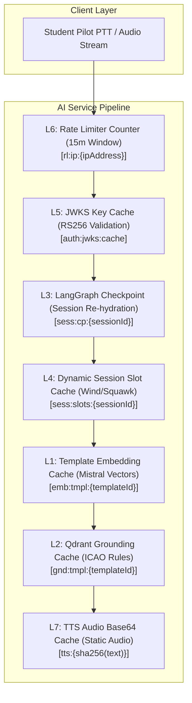
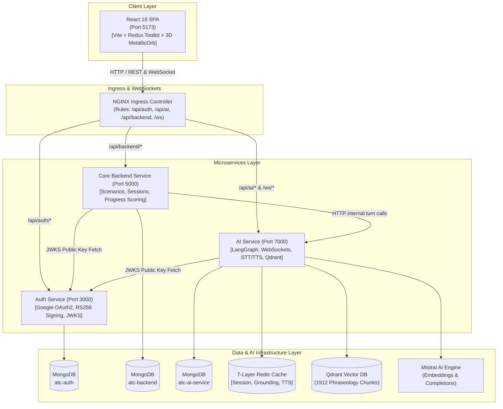

# 🎙️ ATC Voice Simulator — Platform Monorepo

> Enterprise-grade microservice platform for real-time Air Traffic Control (ATC) radio phraseology training & AI voice simulation powered by a **7-Layer Redis Caching Engine**, **LangGraph State Agent**, and **1,912 Vector Qdrant RAG Grounding**.


-purple)


---

## 📖 Table of Contents
- [Overview & Vision](#-overview--vision)
- [The Product MVP: 7-Layer Redis Architecture](#-the-product-mvp-7-layer-redis-caching-architecture)
- [System Architecture & Data Flow](#-system-architecture--data-flow)
- [AI Voice Agent & LangGraph State Machine](#-ai-voice-agent--langgraph-state-machine)
- [1,912 Chunk Qdrant RAG System](#-1912-chunk-qdrant-rag-system)
- [Real-Time WebSockets & 3D MetallicOrb](#-real-time-websockets--3d-metallicorb)
- [Microservices Inventory & Status](#-microservices-inventory--status)
- [Security & RS256 JWKS Authentication](#-security--rs256-jwks-authentication)
- [Monorepo Layout](#-monorepo-layout)
- [Local Development & Quickstart](#-local-development--quickstart)
- [Global API Reference](#-global-api-reference)
- [Developer Guidelines & Quality Probes](#-developer-guidelines--quality-probes)

---

## 🎯 Overview & Vision

The **ATC Voice Simulator** is an interactive, voice-driven AI aviation training platform designed for pilot cadets, student aviators, and Air Traffic Control trainees. The platform emulates real-world VHF radio transmissions across Ground, Clearance Delivery, Tower, Approach, En Route, and Emergency flight phases.

### Core Platform Highlights
- ⚡ **Sub-300ms Voice Latency (MVP):** Powered by our proprietary **7-Layer Redis Caching Architecture** that bypasses LLM composition and vector DB overhead for pre-templated phraseology turns.
- 🧠 **LangGraph Interrupt State Machine:** Stateful turn-by-turn state machine with interrupt boundaries (`awaitReadback`) and conditional routing for standard readbacks vs general pilot inquiries.
- 🔍 **1,912 Chunk RAG Vector Database:** Vector search in Qdrant indexing 100% of all 927 pages of **FAA Order JO 7110.65** and 82 pages of **ICAO Doc 4444**.
- 🎙️ **Push-to-Talk (PTT) & WebSockets:** Half-duplex radio emulation with Spacebar PTT shortcuts, Web Audio API volume visualizers, and WebSocket-driven 3D MetallicOrb reactivity.
- 🛡️ **Zero-Trust Security Infrastructure:** Asymmetric RS256 JWT access tokens validated locally via JWKS key caching and opaque rotating refresh token families.
- 📊 **Cadet Performance Telemetry:** Automated scoring, daily streak tracking, practice time recording, favorite scenario analysis, and weak-area identification.

---

## 🚀 The Product MVP: 7-Layer Redis Caching Architecture

> 📄 *Detailed technical specification available in [`docs/redis_7_layer_architecture.md`](file:///Users/home/Desktop/ATC/docs/redis_7_layer_architecture.md)*

The core technical breakthrough of the platform is the **7-Layer Redis Architecture**. It reduces end-to-end radio turn latency from **~2,600ms down to <280ms**.

```
[STT Speech Capture] ~250ms ➔ [L1/L2 Redis RAG] ~5ms ➔ [Template Engine (0ms LLM)] ~0ms ➔ [L7 Redis TTS] ~5ms
=============================================================================================================
OPTIMIZED REDIS PLATFORM LATENCY = <280ms (REAL-TIME AVIATION RADIO EMULATION)
```



### The 7 Layers Breakdown

| Tier | Layer Name | Redis Key Pattern | TTL | Latency | Key Function |
|---|---|---|---|---|---|
| **L1** | **Template Embedding Cache** | `emb:tmpl:{templateId}` | 30 Days | `~2ms` | Caches pre-computed 1024-dim `mistral-embed` vectors for scenario steps. |
| **L2** | **Qdrant Grounding Cache** | `gnd:tmpl:{templateId}` | 7 Days | `~3ms` | Caches top-k ICAO/FAA phraseology rules to bypass vector DB queries. |
| **L3** | **State Checkpoint Cache** | `sess:cp:{sessionId}` | 24 Hours | `~4ms` | Stores LangGraph `AgentState` for instant PTT resume (<5ms). |
| **L4** | **Dynamic Session Slot Cache** | `sess:slots:{sessionId}` | 24 Hours | `~2ms` | Holds session-randomized variables (wind `270@14`, altimeter `29.92`, squawk `4521`). |
| **L5** | **JWKS Public Key Cache** | `auth:jwks:cache` | 24 Hours | `~1ms` | Caches Auth service RSA public keys for zero-latency local JWT verification. |
| **L6** | **Rate Limiter Counter** | `rl:ip:{ipAddress}` | 15 Mins | `~1ms` | Sliding window rate-limiting counter protecting against LLM credit abuse. |
| **L7** | **TTS Audio Output Cache** | `tts:{sha256(text)}` | 7 Days | `~5ms` | Caches SHA-256 hashed base64 MP3 audio for static controller lines (650ms → 5ms). |

---

## 🏗️ System Architecture & Data Flow



---

## 🧠 AI Voice Agent & LangGraph State Machine

The state machine in [`Ai-service/agent/graph.js`](file:///Users/home/Desktop/ATC/Ai-service/agent/graph.js) orchestrates turn transitions:

```
[Start] ➔ loadStep ➔ qdrantRetrieve ➔ composeLine ➔ ttsSpeak ➔ awaitReadback (INTERRUPT)
                                                                         │
                                                                 validateReadback
                                                                 ┌───────┼───────┐
                                                                 ▼       ▼       ▼
                                                          [Passed] [Question] [Failed]
                                                             │       │       │
                                                   advanceStep  generalAnswer issueCorrection
                                                             │       │       │
                                                          debrief ───┴───────┘
```

1. **`loadStep`**: Fetches step definition & resolves static/dynamic slots from Redis L4.
2. **`qdrantRetrieve`**: Gets grounding phraseology from Redis L2 or Qdrant vector search.
3. **`composeLine`**: FAST-PATH template rendering (~0ms) or LLM fallback.
4. **`ttsSpeak`**: Generates speech via Rime TTS or Redis L7 audio cache (~5ms).
5. **`awaitReadback`**: **INTERRUPT BOUNDARY.** Pauses graph state in Redis L3 until pilot transmits speech.
6. **`validateReadback`**: Uses `mistral-small-latest` & fuzzy slot matcher (NATO phonetics, numbers) to grade pilot readback.
7. **`generalAnswer`**: Handles general pilot inquiries (*"What is VFR ceiling?"*) using Qdrant RAG.
8. **`issueCorrection`**: Issues targeted readback corrections.
9. **`advanceStep`**: Computes score, logs analytics, advances step or triggers `debrief`.

---

## 📚 1,912 Chunk Qdrant RAG System

The RAG engine is populated from official aviation manuals located in `helpers/`:

1. **`ICAO-DOC-4444-Amendment.pdf`** (82 Pages) — Global radiotelephony standards.
2. **`7110.65BB_Bsc_w_Chg_1_2_and_3_dtd_7-9-26_Final.pdf`** (927 Pages) — Full FAA ATC manual.

### Ingestion Pipeline
- `helpers/extract_pdf_text.py` parses **100% of all 1,009 pages** into **1,912 phraseology chunks** (~250 words per chunk with 40-word overlap).
- `Ai-service/scripts/ingestRagDocs.js` batch-embeds vectors using `mistral-embed` with HTTP 429 retry backoff and upserts them into Qdrant `atc_phraseology` collection.

```bash
# Ingest all PDF chunks into Qdrant
npm --prefix Ai-service run ingest-rag

# Verify live Qdrant vector count and search test
npm --prefix Ai-service run verify-rag
```

---

## 🌐 Real-Time WebSockets & 3D MetallicOrb

- **WebSocket Endpoint:** `/ws/simulator` (handled by `Ai-service/config/ws.js`).
- **Telemetry Events:**
  - `ATC_SPEAKING_START`: Emits signal when controller speaks (`intensity: 0.85`).
  - `ATC_SPEAKING_END`: Resets 3D MetallicOrb to idle core mode.
- **Microphone Frequency Visualizer:** Web Audio API frequency bin analysis modulates frequency bars and canvas distortion.

---

## 🧩 Microservices Inventory & Status

| Service | Directory | Port | Primary Responsibilities | Health Probes | Status |
|---|---|---|---|---|---|
| 🔑 **Auth Service** | [`/Auth`](file:///Users/home/Desktop/ATC/Auth/README.md) | `3000` | Google OAuth2, RS256 JWT issuance, opaque refresh token family rotation, JWKS publication | `/healthz`, `/readyz` | 🟢 Production Ready |
| ⚙️ **Core Backend Service** | [`/Backend`](file:///Users/home/Desktop/ATC/Backend/README.md) | `5000` | Training scenarios, session lifecycle, student progress analytics, weak-area tracking | `/healthz`, `/readyz` | 🟢 Production Ready |
| 🧠 **AI Service** | [`/Ai-service`](file:///Users/home/Desktop/ATC/Ai-service/README.md) | `7000` | LangGraph agent, 7-Layer Redis cache, WebSockets, STT/TTS, Qdrant 1,912 RAG search | `/healthz`, `/readyz` | 🟢 Production Ready |
| 🎨 **Frontend Service** | [`/Frontend`](file:///Users/home/Desktop/ATC/Frontend/README.md) | `5173` | React 18 SPA, PTT Spacebar shortcuts, 3D MetallicOrb WebSockets, Landing & Dashboard | `/healthz`, `/ready` | 🟢 Production Ready |

---

## 🛡️ Security & RS256 JWKS Authentication

- **Asymmetric Signing:** Auth service signs JWTs using RSA-4096 private keys.
- **Local Verification:** Downstream microservices verify tokens statelessly via Auth JWKS (`/.well-known/jwks.json`) cached in Redis L5.
- **XSS Defense:** Access tokens stored strictly in JavaScript module closure memory.
- **CSRF Defense:** Refresh tokens stored in `HttpOnly`, `SameSite=Lax` cookies scoped to `/api/auth/refresh`.

---

## 📁 Monorepo Layout

```
ATC/
├── Auth/                               ← Auth & Identity Microservice (Port 3000)
├── Backend/                            ← Core Scenario & Session Service (Port 5000)
├── Ai-service/                         ← AI Inference & Voice Agent Service (Port 7000)
│   ├── agent/                          ← LangGraph state graph & 9 nodes
│   ├── config/                         ← Qdrant, Redis L1-L7, WebSockets
│   ├── models/                         ← ChatMessage, TokenUsageLog, RetrievalLog
│   ├── scripts/                        ← warmTemplateEmbeddings.js, ingestRagDocs.js, verifyRagCollection.js
│   └── services/                       ← stt.service.js, tts.service.js, mistral.service.js, qdrant.service.js
├── Frontend/                           ← React 18 Single Page Application (Port 5173)
│   ├── src/features/landing/           ← LandingPage component & SCSS
│   ├── src/features/dashboard/         ← Dashboard, Scenarios & Stats Hooks
│   └── src/features/simulator/         ← SimulatorPage, PTT, MetallicOrb, WebSockets
├── docs/                               ← Architecture & Technical Specifications
│   └── redis_7_layer_architecture.md   ← 7-Layer Redis Technical Spec
├── helpers/                            ← Source PDF Manuals & Extractor
│   ├── ICAO-DOC-4444-Amendment.pdf
│   ├── 7110.65BB_Bsc_w_Chg_1_2_and_3_dtd_7-9-26_Final.pdf
│   ├── extract_pdf_text.py
│   └── extracted_atc_text.json
├── k8s/                                ← Kubernetes Manifests (Ingress, Deployments, Secrets)
├── skaffold.yml                        ← Skaffold live reload orchestration
└── README.md                           ← Main repository documentation (this file)
```

---

## ⚙️ Local Development & Quickstart

```bash
# 1. Clone repository
git clone https://github.com/your-org/atc-voice-simulator.git
cd atc-voice-simulator

# 2. Extract & Ingest 1,912 PDF Phraseology Chunks into Qdrant
python3 helpers/extract_pdf_text.py
npm --prefix Ai-service run ingest-rag

# 3. Launch live Kubernetes environment with Skaffold
skaffold dev
```

---

## 🔌 Global API Reference

### Auth Service (`/api/auth`)
- `GET /.well-known/jwks.json` — Serves RSA public keys for JWKS validation
- `GET /api/auth/google` — Initiates Google OAuth2 authentication flow
- `POST /api/auth/refresh` — Rotates refresh token and returns fresh RS256 access token
- `GET /api/auth/getMe` — Returns authenticated user profile

### Core Backend Service (`/api/backend`)
- `GET /api/backend/scenarios` — Returns active ATC training scenario templates
- `POST /api/backend/sessions` — Initializes a new ATC simulation session
- `POST /api/backend/sessions/:id/complete` — Concludes training session & records analytics
- `GET /api/backend/users/stats` — Returns student flight hours, streak, & scores
- `GET /api/backend/users/weak-areas` — Identifies weak phraseology categories

### AI Service (`/api/ai`)
- `POST /api/ai/sessions/:id/turn` — Advances LangGraph voice turn machine
- `GET /api/ai/sessions/:id/transcript` — Retrieves session message history
- `GET /api/ai/sessions/:id/tokens` — Returns token usage breakdown per operation
- `GET /ws/simulator` — WebSocket stream for 3D MetallicOrb reactivity

---

## 🧪 Developer Guidelines & Quality Probes

Run the automated microservice documentation validator:

```bash
node .agents/microservice-readme-architect/scripts/validate_readme.js Auth/README.md Backend/README.md Ai-service/README.md Frontend/README.md
```
